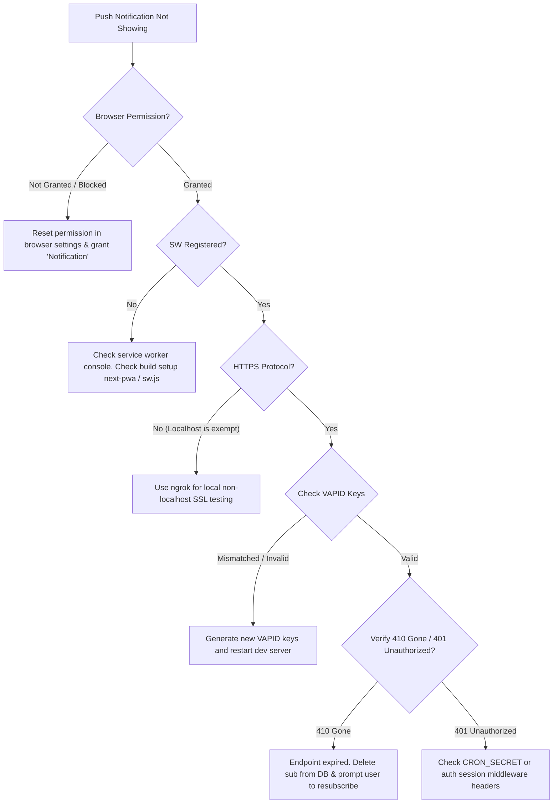

# 🔧 Troubleshooting Guide

A comprehensive, developer-focused reference for diagnosing, debugging, and resolving issues in the StudyFlow ecosystem.

---

## 📋 Table of Contents

- [🔧 Installation & Environment Issues](#-installation--environment-issues)
  - [npm install fails](#npm-install-fails)
  - [Port 3000 already in use](#port-3000-already-in-use)
  - [TypeScript imports cannot find '@/...'](#typescript-imports-cannot-find-)
- [🔐 Authentication & Session Problems](#-authentication--session-problems)
  - [Google OAuth redirect_uri_mismatch](#google-oauth-redirect_uri_mismatch)
  - [Session lost on page refresh](#session-lost-on-page-refresh)
  - [API returns 401 Unauthorized](#api-returns-401-unauthorized)
- [🗄️ Database & Supabase Errors](#-database--supabase-errors)
  - [Connection to database failed](#connection-to-database-failed)
  - [RLS policy: new row violates row-level security policy](#rls-policy-new-row-violates-row-level-security-policy)
  - [Foreign key constraint violations](#foreign-key-constraint-violations)
  - [Migration fails with relation "tasks" already exists](#migration-fails-with-relation-tasks-already-exists)
- [🤖 AI Integration & Gemini Issues](#-ai-integration--gemini-issues)
  - [Gemini API key invalid / Unauthorized](#gemini-api-key-invalid--unauthorized)
  - [Failed to parse tasks from AI response](#failed-to-parse-tasks-from-ai-response)
  - [429 Too Many Requests (Rate Limits)](#429-too-many-requests-rate-limits)
  - [Incorrect relative date calculations](#incorrect-relative-date-calculations)
- [🔔 Web Push Notification Problems](#-web-push-notification-problems)
  - [Push notifications never arrive](#push-notifications-never-arrive)
  - [Invalid VAPID keys / subscription errors](#invalid-vapid-keys--subscription-errors)
  - [Push sending fails with 410 Gone](#push-sending-fails-with-410-gone)
- [📱 PWA & Installation Issues](#-pwa--installation-issues)
  - ["Add to Home Screen" prompt does not show](#add-to-home-screen-prompt-does-not-show)
  - [PWA icons appear as broken images](#pwa-icons-appear-as-broken-images)
  - [App displays offline error screen](#app-displays-offline-error-screen)
  - [iOS-specific installation difficulties](#ios-specific-installation-difficulties)
- [🏗️ Build & Deployment Errors](#-build--deployment-errors)
  - [Build fails locally or in CI](#build-fails-locally-or-in-ci)
  - [Client-side environment variables are undefined](#client-side-environment-variables-are-undefined)
  - [Cron jobs do not trigger or execute](#cron-jobs-do-not-trigger-or-execute)
- [🐌 Performance Troubleshooting](#-performance-troubleshooting)
  - [Dashboard or database queries are slow](#dashboard-or-database-queries-are-slow)
  - [JavaScript bundle size is too large](#javascript-bundle-size-is-too-large)

---

## 🔧 Installation & Environment Issues

### npm install fails
**Error:** `ERESOLVE unable to resolve dependency tree` (typically happens due to React 18 / peer dependency mismatches with older packages).

#### Solutions:
Depending on your shell, execute the appropriate commands below to perform a clean reinstall:

**Windows (PowerShell):**
```powershell
# Clear the npm cache
npm cache clean --force

# Remove node_modules and package-lock.json safely
Remove-Item -Recurse -Force node_modules, package-lock.json

# Reinstall dependencies
npm install
```

**Windows (Command Prompt):**
```cmd
npm cache clean --force
rmdir /s /q node_modules
del package-lock.json
npm install
```

**macOS / Linux (Bash/Zsh):**
```bash
# Clear npm cache and force remove folders
npm cache clean --force
rm -rf node_modules package-lock.json
npm install
```

> [!TIP]
> If npm still raises peer dependency blockages, append `--legacy-peer-deps` to bypass structural checks:
> ```bash
> npm install --legacy-peer-deps
> ```

---

### Port 3000 already in use
**Error:** `Port 3000 is already in use` (another development server is running in the background).

#### Solutions:
Terminate the blocking process or bind the server to a different port.

**Windows (PowerShell/Cmd):**
```powershell
# Find the PID (Process Identifier) listening on port 3000
netstat -ano | findstr :3000

# Kill the process using the PID retrieved (replace <PID> with the actual number)
taskkill /PID <PID> /F
```

**macOS / Linux:**
```bash
# Locate and terminate the process holding port 3000
lsof -ti:3000 | xargs kill -9
```

**Alternative (Change port):**
Start your Next.js development server on a custom port instead:
```bash
npm run dev -- -p 3001
```

---

### TypeScript imports cannot find `@/...`
**Error:** `Cannot find module '@/...' or its corresponding type declarations.`

#### Solutions:
1. **Verify path configuration in `tsconfig.json`:**
   Ensure the `"paths"` field points correctly to your project folders relative to the root:
   ```json
   {
     "compilerOptions": {
       "baseUrl": ".",
       "paths": {
         "@/*": ["./*"]
       }
     }
   }
   ```
2. **Re-initialize TS Language Server:**
   In **VS Code**, press `Ctrl` + `Shift` + `P` (or `Cmd` + `Shift` + `P` on macOS) to bring up the command palette, search for **`TypeScript: Restart TS Server`**, and press Enter.
3. **Trigger Next.js Build Generation:**
   Next.js generates path definitions under `.next/types` dynamically when starting up. Run `npm run dev` or `npm run build` once to force type generation.

---

## 🔐 Authentication & Session Problems

### Google OAuth `redirect_uri_mismatch`
**Error:** `OAuth error: redirect_uri_mismatch` when attempting Google Sign-In.

#### Solutions:
Verify both Google Cloud Console and Supabase Dashboard redirects are identical:

1. **Supabase Redirect Settings:**
   - Go to [Supabase Dashboard](https://supabase.com/dashboard) → **Authentication** → **URL Configuration**.
   - Ensure the Site URL is set to your active instance: `http://localhost:3000` (development) or `https://your-app.vercel.app` (production).
   - Ensure the redirect wildcard path is added: `http://localhost:3000/**`.

2. **Google Cloud Console Settings:**
   - Navigate to [Google Cloud Console](https://console.cloud.google.com) → **APIs & Services** → **Credentials**.
   - Edit your active OAuth 2.0 Client ID.
   - Under **Authorized redirect URIs**, verify you have added:
     `https://<your-supabase-project-id>.supabase.co/auth/v1/callback`

> [!IMPORTANT]
> The redirect URI configured in the Google Console *must* point to your Supabase project's auth callback endpoint, not your client app's domain (Next.js server handle redirects on the server side).

---

### Session lost on page refresh
**Error:** User gets logged out or state resets whenever they refresh their web browser.

#### Solutions:
Confirm cookie management middleware is active in Next.js. This ensures Supabase automatically refreshes expired client sessions during request execution.

```typescript
// middleware.ts
import { createMiddlewareClient } from '@supabase/auth-helpers-nextjs';
import { NextResponse } from 'next/server';
import type { NextRequest } from 'next/server';

export async function middleware(req: NextRequest) {
  const res = NextResponse.next();
  const supabase = createMiddlewareClient({ req, res });
  
  // Crucial: refreshing the user session keeps cookies updated
  await supabase.auth.getSession();
  
  return res;
}
```

---

### API returns 401 Unauthorized
**Error:** Server responds with `401 Unauthorized` on secure API routes (e.g. `/api/parse-task`, `/api/push/subscribe`).

#### Solutions:
Ensure standard cookies are transmitted with frontend API requests and validated in Next.js Route Handlers:

```typescript
// app/api/example/route.ts
import { createRouteHandlerClient } from '@supabase/auth-helpers-nextjs';
import { cookies } from 'next/headers';
import { NextResponse } from 'next/server';

export async function POST(request: Request) {
  const supabase = createRouteHandlerClient({ cookies });
  
  // Retrieve current server-verified session
  const { data: { session } } = await supabase.auth.getSession();
  
  if (!session) {
    return NextResponse.json({ error: 'Unauthorized' }, { status: 401 });
  }
  
  // Safe execution for authenticated user
  const userId = session.user.id;
}
```

---

## 🗄️ Database & Supabase Errors

### Connection to database failed
**Error:** `Connection to database failed` or `Supabase client is not initialized`.

#### Solutions:
1. **Check local environment settings:**
   Verify your `.env.local` contains the correct Supabase parameters:
   ```env
   NEXT_PUBLIC_SUPABASE_URL=https://your-project.supabase.co
   NEXT_PUBLIC_SUPABASE_ANON_KEY=eyJhbGciOi...
   ```
2. **Project Pause Verification:**
   Free-tier projects on Supabase are automatically paused after inactivity. Check your [Supabase Dashboard](https://supabase.com/dashboard). If the project is paused, click **Restore Project** to bring the PostgreSQL instance back online.

---

### RLS policy: new row violates row-level security policy
**Error:** Database operations fail with `new row violates row-level security policy for table "tasks"`.

```mermaid
graph TD
    Query[Client Database Request] --> AuthCheck{User Authenticated?}
    AuthCheck -- "No" --> PublicRLS{RLS Policy Allows Public?}
    AuthCheck -- "Yes" --> UserRLS{Policy matches auth.uid()?}
    PublicRLS -- "Yes" --> Success[Query Executed Successfully]
    PublicRLS -- "No" --> Error401[Error: 401 Unauthorized]
    UserRLS -- "Yes" --> Success
    UserRLS -- "No" --> ErrorRLS[Error: Violates RLS Policy / Returns Empty Array]
```

#### Solutions:
1. **Verify user ID matching in payload:**
   Ensure the `user_id` column of the inserted row matches the authenticated user ID (`auth.uid()`).
2. **Add Missing RLS Policy in Supabase SQL Editor:**
   ```sql
   -- Enable Row Level Security
   alter table public.tasks enable row level security;

   -- Allow users to manage their own tasks
   create policy "Users manage own tasks" 
     on public.tasks 
     for all 
     using (auth.uid() = user_id)
     with check (auth.uid() = user_id);
   ```

---

### Foreign key constraint violations
**Error:** `insert or update on table "tasks" violates foreign key constraint "tasks_user_id_fkey"`.

#### Solutions:
The user ID being inserted does not exist in the referenced `profiles` table. This occurs if user profiles are not successfully initialized immediately following user registration.

Setup a **PostgreSQL Trigger** to automatically generate a profile row when a user signs up:
```sql
-- Trigger function to insert new profile automatically
create or replace function public.handle_new_user()
returns trigger as $$
begin
  insert into public.profiles (id, email, full_name, avatar_url)
  values (
    new.id,
    new.email,
    new.raw_user_meta_data->>'full_name',
    new.raw_user_meta_data->>'avatar_url'
  );
  return new;
end;
$$ language plpgsql security definer;

-- Trigger definition
create or replace trigger on_auth_user_created
  after insert on auth.users
  for each row execute procedure public.handle_new_user();
```

---

### Migration fails with relation "tasks" already exists
**Error:** Database migrations throw schema conflict errors.

#### Solutions:
Use idempotent declarations or selectively clean dirty databases:

> [!CAUTION]
> Dropping tables cascade will wipe all stored database values. Never run this in production without taking a backup first.

```sql
-- Safe migration: Check if table doesn't already exist
create table if not exists public.tasks (
  id uuid default gen_random_uuid() primary key,
  title text not null
);

-- Development reset (CAUTION: erases local/target data)
drop table if exists public.tasks cascade;
```

---

## 🤖 AI Integration & Gemini Issues

### Gemini API key invalid / Unauthorized
**Error:** `[GoogleGenerativeAI Error]: API key not valid. Please pass a valid API key.`

#### Solutions:
1. **Check Environment Key:** Ensure `GEMINI_API_KEY` is specified in `.env.local` without trailing spaces, quote marks, or typos:
   ```env
   GEMINI_API_KEY=AIzaSyA1...
   ```
2. **Key Authority Verification:** Test the key on a generic Gemini model using [Google AI Studio](https://aistudio.google.com) to confirm it is active and not disabled.
3. **Restart the Server:** Next.js caches environment variables. You *must* restart the server to load new variables:
   ```bash
   npm run dev
   ```

---

### Failed to parse tasks from AI response
**Error:** `Failed to parse tasks from AI response` or `SyntaxError: Unexpected token ... in JSON at position 0`.

#### Solutions:
Gemini sometimes embeds Markdown container tags (` ```json ... ``` `) or structural explanations in its output. Update your response parser to safely extract valid JSON arrays:

```typescript
// lib/gemini.ts
function parseResponse(text: string): ParsedTask[] {
  try {
    let cleanText = text.trim();
    
    // Strip markdown JSON styling safely
    cleanText = cleanText.replace(/^```json\s*/i, '');
    cleanText = cleanText.replace(/```$/, '');
    cleanText = cleanText.trim();

    const parsed = JSON.parse(cleanText);
    return Array.isArray(parsed) ? parsed : [parsed];
  } catch (error) {
    console.error('Failed parsing Gemini content:', text);
    throw new Error('Invalid JSON format returned from Gemini');
  }
}
```

---

### 429 Too Many Requests (Rate Limits)
**Error:** `429 Too Many Requests` (exceeding API quota limits).

#### Solutions:
Implement **Exponential Backoff** logic for retry operations to gracefully handle high traffic density:

```typescript
// lib/gemini.ts
export async function retryWithBackoff<T>(
  fn: () => Promise<T>, 
  maxRetries = 3, 
  delayMs = 1000
): Promise<T> {
  for (let attempt = 1; attempt <= maxRetries; attempt++) {
    try {
      return await fn();
    } catch (error: any) {
      const isRateLimit = error?.status === 429 || error?.message?.includes('429');
      if (isRateLimit && attempt < maxRetries) {
        const backoffDelay = delayMs * Math.pow(2, attempt);
        console.warn(`[Gemini 429] Retrying in ${backoffDelay}ms... (Attempt ${attempt}/${maxRetries})`);
        await new Promise(res => setTimeout(res, backoffDelay));
        continue;
      }
      throw error;
    }
  }
  throw new Error('Max retry attempts reached');
}
```

---

### Incorrect relative date calculations
**Error:** User sends *"due next Friday"*, and the AI resolves it to a date in the past or several months in the future.

#### Solutions:
Provide the current relative context dynamically inside the AI prompt. This gives Gemini an anchor point for date math:

```typescript
// Prompt building logic
const getPromptContext = (currentDate: Date = new Date()) => {
  const today = currentDate.toISOString().split('T')[0];
  const dayName = currentDate.toLocaleDateString('en-US', { weekday: 'long' });
  
  return `
    Current Date Today: ${today} (${dayName})
    
    Rules for date inference:
    - "tomorrow" -> ${new Date(currentDate.getTime() + 86400000).toISOString().split('T')[0]}
    - If user mentions a specific day (e.g. "due on Friday"), calculate the immediate next date matching that day name.
  `;
};
```

---

## 🔔 Web Push Notification Problems

### Push notifications never arrive



#### Solutions:
1. **Check Notification permissions inside browser:**
   Open browser dev tools console and run:
   ```javascript
   Notification.permission // Must return 'granted'
   ```
   If it returns `denied` or `default`, click the padlock icon in the browser address bar and enable **Notifications**.

2. **Verify secure connection requirements:**
   Push notifications *require* HTTPS. Localhost is exempt, but if you are testing on mobile or custom domains, you must run an HTTPS proxy (e.g., using `ngrok`):
   ```bash
   npx ngrok http 3000
   ```

3. **Validate Service Worker activation:**
   Open **Chrome Developer Tools** → **Application** → **Service Workers**. Check if the service worker is active. You can press the **"Push"** button inside DevTools to trigger a simulated test notification payload.

---

### Invalid VAPID keys / subscription errors
**Error:** `Invalid VAPID keys` or failed push subscriptions.

#### Solutions:
Regenerate your VAPID keys and ensure the private key remains secure (never expose it on the frontend):

```bash
# Generate key pair
npx web-push generate-vapid-keys
```

Update your `.env.local`:
```env
NEXT_PUBLIC_VAPID_PUBLIC_KEY=BLk_Your_Public_Key_Here
VAPID_PRIVATE_KEY=Your_Private_Key_Here
VAPID_MAILTO=mailto:developer@studyflow.app
```

> [!WARNING]
> Frontend client operations must *only* read the `NEXT_PUBLIC_VAPID_PUBLIC_KEY`. Exposure of your `VAPID_PRIVATE_KEY` on the client side compromises notification authorization.

---

### Push sending fails with `410 Gone`
**Error:** Server gets response error `410 Gone` when hitting Web Push servers.

#### Solutions:
The push endpoint has expired or the user has unregistered the service worker. Clean up these dead subscriptions from the database to keep tables clean:

```typescript
// app/api/push/send/route.ts
try {
  await webpush.sendNotification(subscription, payload);
} catch (error: any) {
  if (error.statusCode === 410) {
    // Delete subscription record from DB
    await supabase
      .from('push_subscriptions')
      .delete()
      .eq('endpoint', subscription.endpoint);
    console.log(`Deleted stale subscription: ${subscription.endpoint}`);
  }
}
```

---

## 📱 PWA & Installation Issues

### "Add to Home Screen" prompt does not show
**Error:** The PWA installation badge or prompt does not activate in client browsers.

#### Solutions:
Verify PWA compliance using Lighthouse audits or checking manifest attributes:

1. **Check Manifest configuration (`public/manifest.json`):**
   Ensure all critical keys are defined exactly as shown below:
   ```json
   {
     "name": "StudyFlow",
     "short_name": "StudyFlow",
     "start_url": "/",
     "display": "standalone",
     "background_color": "#0d0e15",
     "theme_color": "#7c3aed",
     "icons": [
       {
         "src": "/icons/icon-192x192.png",
         "sizes": "192x192",
         "type": "image/png"
       },
       {
         "src": "/icons/icon-512x512.png",
         "sizes": "512x512",
         "type": "image/png"
       }
     ]
   }
   ```
2. **Review registration script:**
   Verify your main application layout imports and executes Service Worker registration when mounting:
   ```javascript
   if ('serviceWorker' in navigator) {
     window.addEventListener('load', () => {
       navigator.serviceWorker.register('/sw.js');
     });
   }
   ```

---

### PWA icons appear as broken images
**Error:** Icons fail to load when installing StudyFlow on Desktop or mobile homescreens.

#### Solutions:
- Confirm icons are stored in the `/public` root under `/icons/icon-192x192.png` and `/icons/icon-512x512.png` matching your manifest entries.
- Clear browser cache and service worker caches via **DevTools** → **Application** → **Storage** → **Clear site data**.

---

### App displays offline error screen
**Error:** StudyFlow fails to fall back gracefully when the network goes offline.

#### Solutions:
Ensure the Service Worker caches core static pages during the installation hook:

```javascript
// public/sw.js
const CACHE_NAME = 'studyflow-cache-v1';
const OFFLINE_URL = '/offline.html';

self.addEventListener('install', (event) => {
  event.waitUntil(
    caches.open(CACHE_NAME).then((cache) => {
      return cache.addAll([
        '/',
        OFFLINE_URL,
        '/favicon.ico',
        '/icons/icon-192x192.png'
      ]);
    })
  );
});

self.addEventListener('fetch', (event) => {
  if (event.request.mode === 'navigate') {
    event.respondWith(
      fetch(event.request).catch(() => {
        return caches.match(OFFLINE_URL);
      })
    );
  }
});
```

---

### iOS-specific installation difficulties
**Error:** Users on iOS cannot find an install button or prompt.

#### Solutions:
- **Safari is mandatory:** Apple restricts PWA installation triggers on iOS. Users must open the application in Safari.
- **Instruct the user:** Tap the **Share** button in Safari, scroll down, and tap **"Add to Home Screen"**.
- Ensure Safari apple icons are defined inside `layout.tsx` metadata headers:
  ```html
  <meta name="apple-mobile-web-app-capable" content="yes" />
  <meta name="apple-mobile-web-app-status-bar-style" content="black-translucent" />
  <link rel="apple-touch-icon" href="/icons/icon-192x192.png" />
  ```

---

## 🏗️ Build & Deployment Errors

### Build fails locally or in CI
**Error:** `npm run build` fails with linter or type-checking issues.

#### Solutions:
Run linting and type checks independently before executing the bundler to pinpoint issues:

```bash
# Run ESLint validation
npm run lint

# Validate TypeScript structure compiles clean
npm run type-check

# Clear local Next.js bundle caches
# Windows (PowerShell)
Remove-Item -Recurse -Force .next

# Linux/macOS
rm -rf .next
```

---

### Client-side environment variables are undefined
**Error:** Environment variables are `undefined` on the frontend client (e.g. Supabase connection URLs).

#### Solutions:
Next.js secures your secrets by keeping them server-side by default. To expose them to browser clients, variables **must** be prefixed with `NEXT_PUBLIC_`:

```env
# Exposed to the client:
NEXT_PUBLIC_SUPABASE_URL=https://project.supabase.co

# Hidden server-side only:
SUPABASE_SERVICE_ROLE_KEY=ai_secret_key_role
```

---

### Cron jobs do not trigger or execute
**Error:** Vercel Cron routes configured under `/api/cron` do not run at scheduled intervals.

#### Solutions:
1. **Validate `vercel.json` location:** Make sure `vercel.json` resides directly in your project root:
   ```json
   {
     "crons": [
       {
         "path": "/api/cron/morning-digest",
         "schedule": "0 7 * * *"
       }
     ]
   }
   ```
2. **Verify Cron Security check:** Ensure your cron route handler evaluates the `Authorization` header correctly:
   ```typescript
   const authHeader = request.headers.get('authorization');
   if (authHeader !== `Bearer ${process.env.CRON_SECRET}`) {
     return NextResponse.json({ error: 'Unauthorized' }, { status: 401 });
   }
   ```

---

## 🐌 Performance Troubleshooting

### Dashboard or database queries are slow
**Issue:** Dashboard takes several seconds to load user tasks.

#### Solutions:
1. **Ensure Database indexes exist on high-traffic columns:**
   Run the following query in the Supabase SQL editor to index frequently queried columns:
   ```sql
   create index if not exists idx_tasks_user_due 
     on public.tasks (user_id, due_date);
   ```
2. **Limit query payload:**
   Avoid downloading unnecessary data by selecting only the columns you need:
   ```typescript
   // ❌ Bad: selecting all columns
   const { data } = await supabase.from('tasks').select('*');

   // ✅ Good: selecting specific columns and adding limits
   const { data } = await supabase
     .from('tasks')
     .select('id, title, due_date, status')
     .eq('user_id', userId)
     .limit(50);
   ```

---

### JavaScript bundle size is too large
**Issue:** Large client bundle sizes delay page loading and degrade performance scores.

#### Solutions:
1. **Implement Next.js Dynamic Imports:**
   Load heavy UI components (e.g., charts, voice recorders, markdown editors) only when needed:
   ```tsx
   import dynamic from 'next/dynamic';

   // Dynamic loading with fallback UI
   const HeavyVoiceRecorder = dynamic(
     () => import('@/components/VoiceRecorder'),
     { loading: () => <p>Loading recorder...</p>, ssr: false }
   );
   ```
2. **Analyze package bundles:**
   Install bundle analyzer to find large third-party dependencies:
   ```bash
   npm install @next/bundle-analyzer
   ```
   Configure `next.config.js` to enable output reviews upon executing builds.

---

## 📞 Getting More Help

If you run into issues not covered in this guide:

1. **Check related guides in `docs/`:**
   - For PWA details, see [PWA Guide](./PWA.md)
   - For database and server settings, see [Backend Guide](./BACKEND.md)
   - For Gemini issues, see [AI Integration Guide](./AI.md)
2. **File a detailed bug report:** Include the context details below when posting in issues or discussions:
   ```markdown
   **Development Specs:**
   - OS: [e.g. Windows 11]
   - Node Version: [e.g. 20.9.0]
   - Browser: [e.g. Chrome 124]

   **Expected Outcome:**
   [Brief description of expected behavior]

   **Actual Error Context:**
   [Include specific logs, error stacks, or screenshots]
   ```
